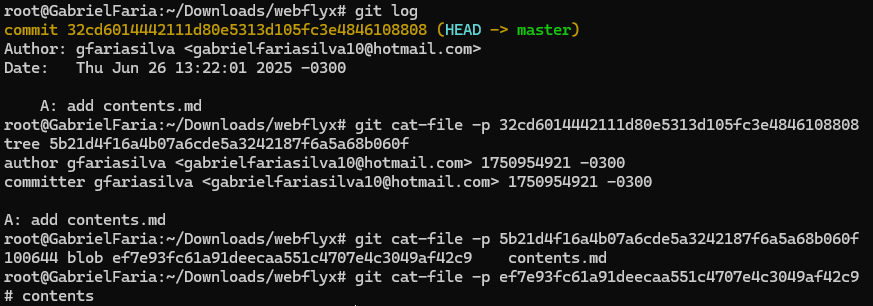
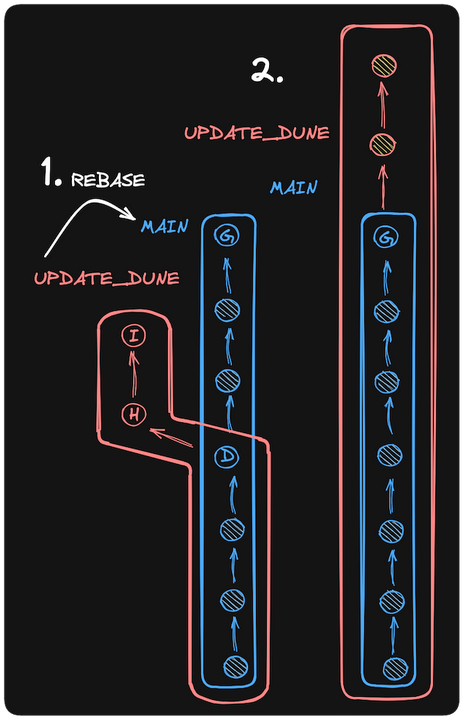
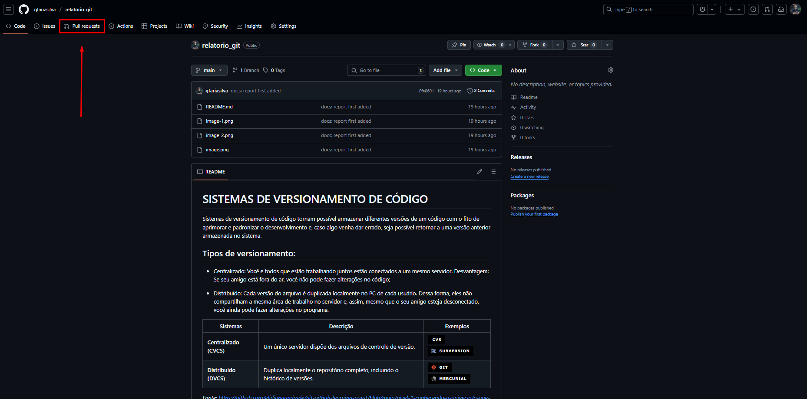

# SISTEMAS DE VERSIONAMENTO DE CÓDIGO
Sistemas de versionamento de código tornam possível armazenar diferentes versões de um código com o fito de aprimorar e padronizar o desenvolvimento e, caso algo venha dar errado, seja possível retornar a uma versão anterior armazenada no sistema.

## Tipos de versionamento:
- Centralizado: Você e todos que estão trabalhando juntos estão conectados a um mesmo servidor. Desvantagem: Se seu amigo está fora do ar, você não pode fazer alterações no código;
  
- Distribuído: Cada versão do arquivo é duplicada localmente no PC de cada usuário. Dessa forma, eles não compartilham a mesma área de trabalho no servidor e, assim, mesmo que o seu amigo esteja desconectado, você ainda pode fazer alterações no programa.

| Sistemas                | Descrição                                                                    | Exemplos                                                                                                                                                                  |
| ----------------------- | ---------------------------------------------------------------------------- | ------------------------------------------------------------------------------------------------------------------------------------------------------------------------- |
| **Centralizado (CVCS)** | Um único servidor dispõe dos arquivos de controle de versão.                 |  |
| **Distribuído (DVCS)**  | Duplica localmente o repositório completo, incluindo o histórico de versões. |     |

*Fonte: https://github.com/elidianaandrade/git-github-learning-quest/blob/main/nivel-1-conhecendo-o-universo/o-que-e-versionamento-de-codigo.md?plain=1*

O **git** é um sistema de versionamento de código **distribuído** inventado por Linus Torvalds em 2005 e hoje é o sistema de versionamento mais utilizado por desenvolvedores ao redor do mundo.

# GIT
## Estrutura básica dos comandos:
```shell
command <required> [optional]
```
Os comandos seguem a estrutura acima:

- Argumentos obrigatórios são passados com `<>`;
- Arguments opcionais são passados com `[]`;

## Comandos:

Em primeiro passo, foi necessário instalar o git via WSL:

```shell
sudo apt install git-all
```

Para verificar a versão instalada:

```shell
git --version
```

Os comandos do git são separados em duas categorias principais: comandos de **alto nível** (*porcelain*) e comandos de **baixo nível** (*plumbing*).

- Alto nível:

    - `git status`
    - `git add`
    - `git commit`
    - `git push`
    - `git pull`
    - `git log`

- Baixo nível:

    - `git apply`
    - `git commit-tree`
    - `git hash-object`

Comandos de alto nível são utilizados em 99% das situações do dia-a-dia.

Para configuração do ambiente com o fito de integrar com uma plataforma que utiliza o git (**GitHub**, por exemplo), utilizar os comandos de configuração:

```shell
git config --add --global user.name "github_username_here"
```

```shell
git config --add --global user.email "email@example.com"
```

Para acessar uma configuração -> ex: acessar a informação user.name:

```shell
git config --get <key>
```

Para remover uma configuração:

```shell
git config --unset <key>

ou

git config --unset-all <key> -> Remove todas ocorrências de uma chave (podem existir chaves duplicadas)
```

## Repositórios

Um projeto **git** é determinado por um **repositório**, que basicamente é um diretório contendo pastas e arquivos do seu projeto. O que torna, por sua vez, o diretório em um repositório é uma pasta oculta de nome **.git**. É nesse diretório que o git aramzena todas as informações de versionamento do projeto.

Iniciar um repositório local:

```shell
git init
```

Um arquivo dentro de um reposítório pode estar em um de vários **estados**:

- *Untracked*: git não tem informações do arquivo;
- *Staged*: arquivos marcados para inclusão no próximo commit;
- *Commited*: arquivos *commitados* e salvos no histórico do repositório.

Para exibir os status do conteúdo de um repositório:

```shell
git status
```

A princípio, todos novos arquivos são *Untracked* por natureza e, para que o git passe a ter conhecimento sobre a existência deles, é necessário rodar o comando:

```shell
git add <path-to-file | pattern> -> adicionando arquivo específico
git add .                        -> adicionando todos arquivos de um respositório
```

Com o git tendo conhecimento dos arquivos do seu repositório, nós podemos *commitar*.

Um **commit** basicamente é uma *foto* do seu repositório atual e, com isso, o git consegue fazer o gerenciamento das diversas versões (**commits**) do seu código - como boa prática, faz-se necessário documentar as mudanças feitas pelo commit via uma mensagem:

```shell
git commit -m "your message here"
```

Um repositório, portanto, pode ser definido como uma **lista de commits, onde cada um representa um determinado estado do repositório em um certo ponto do tempo**.

Cada commit tem um identificador único denominado **hash** e, para visualizar o histórico de *commits*:

```shell
git log
```

O seguinte comando:

```shell
git cat-file -p <hash>
```

Permite analisar um *commit*, *tree*, ou *blob* pelo seu respectivo hash:



**OBS:** Uma árvore (**tree**) está relacionada com o diretório e um objeto (**blob**) com um arquivo de um *commit*. Como visto pela imagem, ao acessar o *blob* pelo seu hash, foi possível visualizar seu conteúdo.

## Branches
Uma **branch** representa uma ramificação no seu repositório, que mantém informações e mudanças de forma separada de outras ramificações.

Por exemplo, digamos que você queira experimentar mudar a cor de um site. Para isso, você pode criar uma branch *mudanca_de_cor* e fazer alterações sem afetar diretamente a branch principal do projeto (**main** ou **master**). Caso você goste das alterações, é possível mesclar (**merge**) sua nova branch com a branch principal, salvando assim as alterações.

Em resumo, **branch é um ponteiro para um commit específico**. Quando você commita em uma branch, ela passa a **apontar para o próximo commit**, e assim por diante.


Para verificar a branch que você está atualmente no seu repositório:

```shell
git branch
```

Normalmente, a branch padrão do git vem nomeada como **master**, mas, o GitHub, por instância, utiliza a nomenclatura **main** para se referir à branch principal do projeto. Por isso, como utilizaremos o GitHub, se faz necessário trocar a nomenclatura no git:

```shell
git config --global init.defaultBranch main -> troca o nome para repositórios futuros

e

git branch -m master main -> renomeia no projeto atual
```

Para criar uma nova branch:

```shell
git branch my_new_branch

ou

git switch -c my_new_branch -> cria e troca imediatamente
```

Para trocar de uma branch para outra:

```shell
git switch prime

ou

git checkout prime -> método antigo
```

## Merge
Como visto anteriormente, o conceito de branches permite a realização de alterações no programa sem afetar o código em produção, porém, uma vez será necessário "juntar" esse código de novo na branch principal, e é aí que o conceito de **merge** entra em ação.

Digamos que você tem duas branches, cada uma com seus commits únicos:

```
A - B - C    main
   \
    D - E    other_branch
```

Se você juntar (**merge**) as duas branches, o git cria um novo commit que tem ambos históricos de ambas branches como "pais" desse novo commit:

```
A - B - C - F    main
   \     /
    D - E        other_branch
```

Para fazer um **merge** de uma outra branch na **main**, por exemplo, enquanto está na main, rodar o comando:

```shell
git merge other_branch
```

Depois do **merge**, caso não venha mais a utilizar a branch, é uma boa prática deletá-la a fim de evitar acúmulo de informações no futuro:

```shell
git branch -d other_branch
```

## Rebase
**Rebase** permite "atualizar" o ponto de divergência de uma branch em relação a outra. Por exemplo, digamos que tenhamos esse histórico de commits:

```
A - B - C    main
   \
    D - E    feature_branch
```

Digamos que queiramos trazer as mudanças do commit adicional **C** da main para a branch *feature_branch*, para que assim possamos ter as características mais atualizadas na nova branch. Nós poderíamos fazer um merge das duas branches, mas isso criaria um *commit de branch* adicional.

Dessa forma, o comando **Rebase** evita um *commit de merge* trocando a origem da branch para o commit mais recente da main, ou seja, o novo histórico ficaria assim:

```
A - B - C         main
         \
          D - E   feature_branch
```

Para executarmos um **rebase**, digamos que estamos na branch *other_branch* e que queremos trazer as mudanças da branch main para a branch atual. Enquanto na branch *other_branch*, executar o comando:

```shell
git rebase main
```

O git seguirá os passos:

1. Identificar o último commit realizado na main;
2. Usar esse commit como nova base temporária para o processo de rebase;
3. Atualizar a branch *other_branch* para apontar para o commit que serve como nova base temporária;
4. O rebase não afeta a main; *other_branch* agora contém todas as alterações da main.



Acima, exemplo do mesmo processo com uma branch nomeada *update_dune*.

### Diferenças entre Rebase x Merge
Uma vantagem do **merge** é que este preserva o verdadeiro histórico do projeto, mostrando onde as branches sofreram merge, etc. Porém, tal processo cria muitos *merge commits*, o que torna o histórico mais difícil de ser lido.

O **Rebase** permite um histórico mais linear, o que pode ser preferível em alguns casos, mas isso vai de cultura para cultura dentro da empresa.

## Reset
Como o git, por ser um sistema de versionamento de código, consegue armazenar várias versões e commits, é possível retornar a versões anteriores deste e desfazer alterações se necessário. Isso se dá pelo comando:

```shell
git reset --soft COMMITHASH
```

O comando desfaz o último commit e, com o parâmetro `--soft`, retorna à um commit anterior sem perder as alterações do commit atual - Tais alterações não estarão *commitadas*. **É possível descobrir o hash do commit desejado pelo comando `git log`**.

Caso não queira manter o estado atual do commit e deseje voltar completamente ao estado do commit anterior, perdendo as alterações atuais, utilizar o parâmetro `--hard`:

```shell
git reset --hard COMMITHASH
```

**OBS**: **CUIDADO!!!** Utilizar o parâmetro `--hard` faz com que você perca de forma irrecuperável as alterações presentes no commit atual.

## Remote
No git, um repositório superior é chamado de **remote** e, quando este é o principal, comumente é denominado `origin`. O comando para adicionar um remote no seu repositório local:

```shell
git remote add <name> <uri>
```

No parâmetro `name` você determina o nome do repositório - que comumente é `origin`, como explicitado anteriormente - e em `uri`, o caminho desse repositório - pode ser um repositório local, com o caminho do seu sistema ou, por exemplo, a url de um repositório do GitHub.

Agora, para trazer o conteúdo desse repositório **remote** para o seu repositório **local**, primeiramente:

```shell
git fetch
```

Isso faz automaticamente o download das cópias de todos os conteúdos da pasta `.git/objects` do repoitório remote para o seu local. Apesar de termos todos os metadados do repositório remote, não significa que temos todos os arquivos.

**OBS:** Também é possível fazer merge de branches locais com branches remotas. Para isso, rodar o seguinte comando no repositório local:

```shell
git merge remote/branch
```

Para trazer não só metadados e sim todos os arquivos de um repositório remoto, executar:

```shell
git pull [<remote>/<branch>]
```

Os parâmetros desse comando são opcionais. Caso eles não sejam passados, você vai trazer a sua branch atual do repositório remoto.

**OBS**: O comando `git pull` cria um commit de merge, ou seja, pode ser definido de forma informal como a junção de `git fetch` e `git merge`.

# GITHUB
O **GitHub** é o site mais popular de gerenciamento de repositórios Git online. Em resumo, ele **hospeda repositórios remotos de forma centralizada em um website**.

Além disso, também tem outras funcionalidades, como:

- Servir como backup do seu código na nuvem;
- Servir como um local central para compartilhar seu código / contribuir com códigos de outros;
- Servir como um portfólio para seus projetos.

É possível criar repositórios remotos pelo console / CLI do GitHub.

Até o momento, apenas salvamos alterações no nosso repositório remoto via **commits**, porém, para subirmos essas alterações em um repositório remoto - no nosso caso, um hospedado no **GitHub** - é necessário executar o comando:

```shell
git push origin <localbranch>:<remotebranch>
```

Ou, na maioria dos casos:

```shell
git push origin main
```

Onde `origin` é a nomenclatura para o repositório remoto e `main` a branch principal deste.

## Pull Requests
Pull Requests são formas de propor mudanças no código, evitando assim que todos do time façam upload direto na `main`, por exemplo. Estes permitem que os membros de um time vejam quais mudanças estão sendo propostas e discutam quais passarão para produção ou não.



É possível analizar e criar Pull Requests na aba como demonstrado acima.

## .gitignore
É comum você não querer que o git suba determinados arquivos / diretórios para seu repositório por conta de diversos motivos, entre os principais:

- .env -> contém informações sensíveis como chaves privadas, etc;
- Dependências -> pycache, node_modules, etc. Tais pastas contém as dependências / bibliotecas da sua aplicação e, por conta disto, costumam pesar muito.

Exemplo de um arquivo `.gitignore`:

```shell
node_modules 
```

Isso vai ignorar todo diretório / arquivo de nome `node_modules`, ou seja, ignora:

```
node_modules/code.js
src/node_modules/code.js
src/node_modules
```

Não ignora:

```
src/node_modules_2/code.js
env/node_modules_3
```

É comum também ter diversos `.gitignore` aninhados em um projeto. Cada `.gitignore` se aplica somente ao diretório que está inserido.

Digamos que você tenha a seguinte árvore de projeto:

```
src/
├── assets/
│   ├── .gitignore
|   ├── cover_art.jpg
│   └── onlydevs.png
├── main.py
├── tests.py
├── venv/
│   └── bin/
|       ├── activate
│       └── python
.gitignore
```

Nesse caso, o `.gitignore` dentro da pasta `assets` conterá:

```shell
onlydevs.png
```

E o `.gitignore` na pasta `root`:

```shell
venv/bin/activate
```